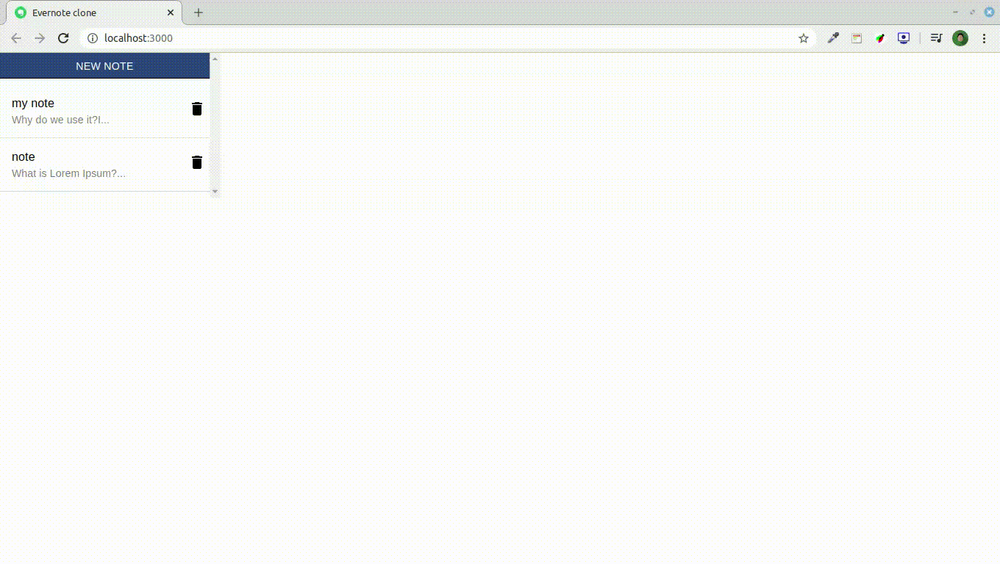

    

  

   <h1 align="center">Evernote-clone</h1>

    
 

## Simples evernote-clone  
  
Evernote-clone is a simple application with real time database

## Stack used

[ReactJS](https://reactjs.org/) 
[Firebase](https://console.firebase.google.com/) 
[Yarn](https://yarnpkg.com/en/) 
[Material-UI](https://material-ui.com/) 
